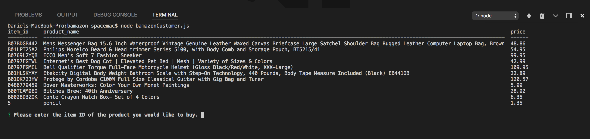

<h1>bamazon</h1>

Project source can be downloaded from https://github.com/danshook/bamazon.

<h3>Author</h3>

Daniel Shook

<h3>Overview</h3>
This command line interface (CLI) app was developed as part of a software development course assignment. In this assignment, I created an Amazon-like storefront using MySQL and Node.js. The app will take in orders from customers and deplete stock from the store's inventory.

