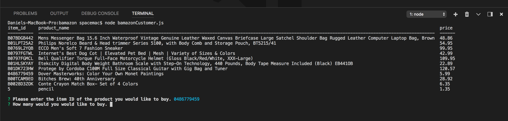
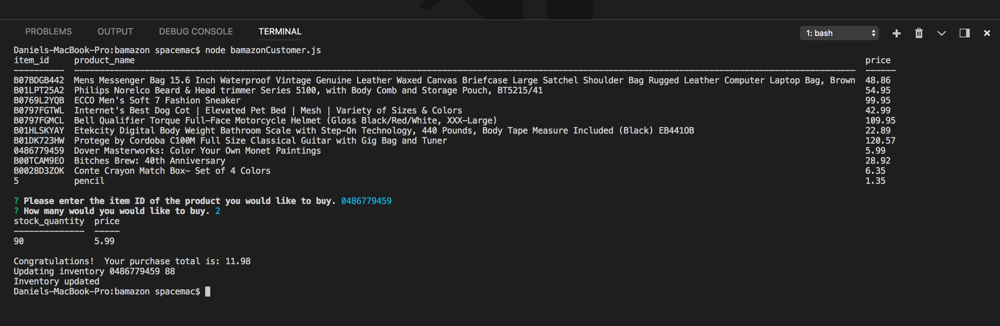

<h1>bamazon</h1>

Project source can be downloaded from https://github.com/danshook/bamazon.

<h3>Author</h3>

Daniel Shook

<h3>Overview</h3>
This command line interface (CLI) app was developed as part of a software development course assignment. In this assignment, I created an Amazon-like storefront using MySQL and Node.js. The app will take in orders from customers and deplete stock from the store's inventory.
 
<h4>After initiating the app, it will display all product names with their respective item IDs and prices. It then prompts the user to enter the ID of the product they wish to purchase.</h4>

 

<h4>After the user enters the quantity of the product they wish to purchase, the app will check with the database to ensure there is adequate inventory to satisfy the order. If so, the user will receive this message:</h4>

